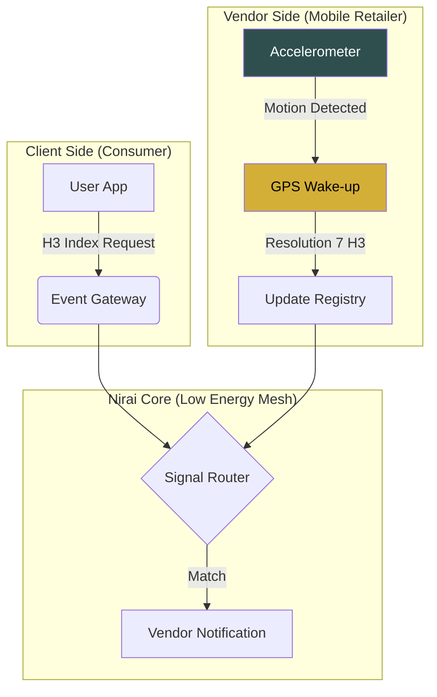

# Nirai (நிறை)
**Geo-Temporal Synchronization for Decentralized Retailers**

Nirai is a high-efficiency service mesh designed to connect street vendors with local demand in real-time while solving for high energy costs and network instability.

### 🛠️ Core Engineering
- **Battery-First Tracking:** Accelerometer-gated GPS updates (only polls when movement is detected).
- **Network Efficiency:** H3 Spatial Indexing (Resolution 7) to reduce coordinate payload sizes.
- **Micro-Market UX:** "Old Money" aesthetic (Serif-first, muted palette) for a premium, grounded user experience.
- **Scalable Backend:** Event-driven architecture using light-weight signaling.

