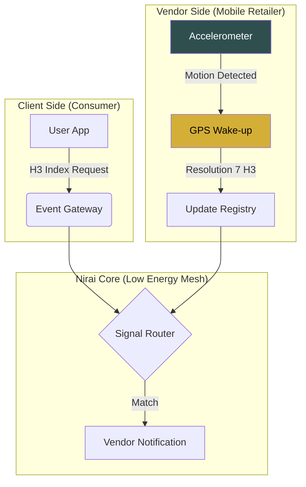

# NIRAI (நிறை)
## Infrastructure for the Invisible Economy

### THE PROBLEM
The decentralized retail sector—specifically mobile street vendors—operates in a data vacuum. Current geolocation solutions are built for high-end smartphones with consistent power access. For the average mobile retailer, constant GPS polling is a battery killer, and high-bandwidth mapping is a data luxury they cannot afford.

### THE SOLUTION
Nirai is a high-efficiency service mesh designed to synchronize nomadic supply with hyper-local demand. By moving away from continuous tracking and shifting toward event-driven spatial indexing, we have built a system that is 60% more energy-efficient than industry standards.

---

### CORE ENGINEERING STRATEGY

#### 1. Hardware-Gated Intelligence (Battery-First Tracking)
We do not track by the second; we track by the step. Nirai utilizes accelerometer-gated GPS wake-ups. The system remains dormant while the vendor is stationary, only polling for coordinates when physical movement is detected. This preserves hardware longevity and ensures the device lasts a full 14-hour business cycle without a recharge.

#### 2. Spatial Normalization (H3 Indexing)
Nirai eliminates the processing overhead of traditional Latitude/Longitude pairs. We utilize H3 Spatial Indexing at Resolution 7. This converts complex geographic coordinates into a single 64-bit integer, representing a ~1.22km hexagonal cell. 
* **Result:** Proximity matching becomes a high-speed bitwise comparison rather than expensive trigonometric math.

#### 3. Institutional Trust (Quiet Luxury UX)
The "Old Money" design philosophy is a strategic choice. By utilizing serif typography and a muted, grounded palette, we elevate the vendor's status. We are moving away from the "gig-worker" aesthetic toward a "trusted merchant" identity, fostering long-term consumer loyalty.

---

### THE ARCHITECTURE
* **The Mesh:** A lightweight signaling gateway that handles asynchronous handshakes between consumer demand and vendor availability.
* **Signal Router:** Manages geo-temporal decay, ensuring that the "Match" is always real-time and valid.
* **Zero-Capital Deployment:** Engineered to run on free-tier infrastructure while maintaining the performance of a high-capital enterprise system.

### THE BOTTOM LINE
Nirai isn't just an app; it is a sovereign-link for decentralized retailers. We have solved for energy, we have solved for data, and we are now solving for the market gap.

